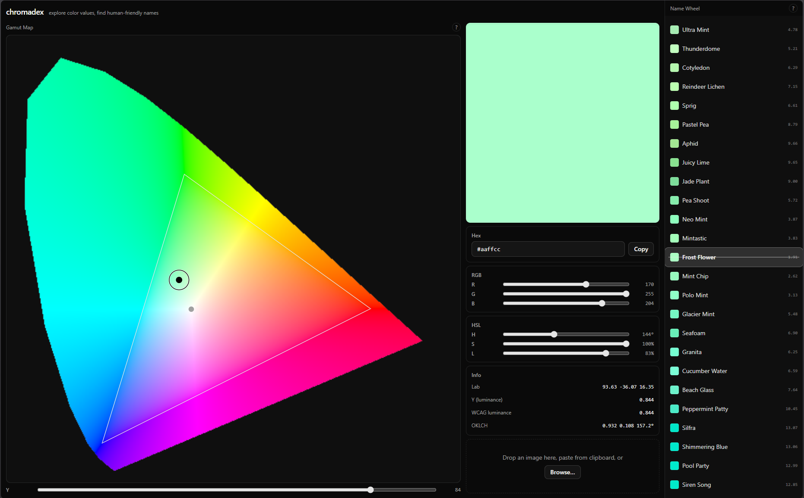

# chromadex

A fun-first named-color picker. Explore a color's value on a CIE 1931 chromaticity map, find human-friendly names for it, and pick colors straight out of an image.

## What you can do

- Edit the current color through three synced Drivers — hex, RGB, and HSL. Change any one and the rest follow.
- Read the Gamut Map: the CIE 1931 chromaticity horseshoe plus a luminance slider, showing where the current color sits among all producible colors. Drag the two-way Cursor to explore.
- Scroll the Name Wheel: a live strip of 4,444 names, blue-noise-distributed through OKLab, radiating outward from the current color like a gradient path. Whatever sits under the needle is the color.
- Sample colors from an image with the Eyedropper — upload, drag-and-drop, or paste.
- Copy values, or share a `?color=` URL.
- Operate the whole app from the keyboard, with reduced-motion support and tooltips that explain the color science behind what you're seeing.



## How it was built

chromadex was designed through an interview-style grilling session, specified as tickets in a local issue tracker, then implemented by AI worker agents. Every feature ticket was reviewed by a separate fresh-context reviewer agent before it landed. The owner's role: direction, decisions, and taste.

The result so far: two dozen feature tickets, 212 passing tests, and a domain glossary (`CONTEXT.md`) that keeps every term — Driver, Cursor, Name Wheel — exact. It's in the repo if you're curious.

## Development

Prerequisites: Node 22.12+ (Vitest requires it).

```sh
npm install
npm run dev      # dev server
npm test         # vitest run
npm run build    # typecheck + production build
```

Stack: React 19, TypeScript, Vite, Tailwind CSS v4, shadcn/ui.

## Credits

- [colornames-oklab](https://github.com/meodai/colornames-oklab) (MIT) and [color-names](https://github.com/meodai/color-names) (MIT) by meodai — the name datasets behind the wheel. Some of the names in the colornames-oklab dataset were generated with the help of Claude (Anthropic), as that project's README credits; its 31,914-name ancestor is deliberately human-curated. Full dataset provenance and the vendored license texts live in [src/lib/color-names/ATTRIBUTION.md](src/lib/color-names/ATTRIBUTION.md).
- CIE 1931 standard-observer data, the basis of the Gamut Map.

## License

[MIT](LICENSE)
